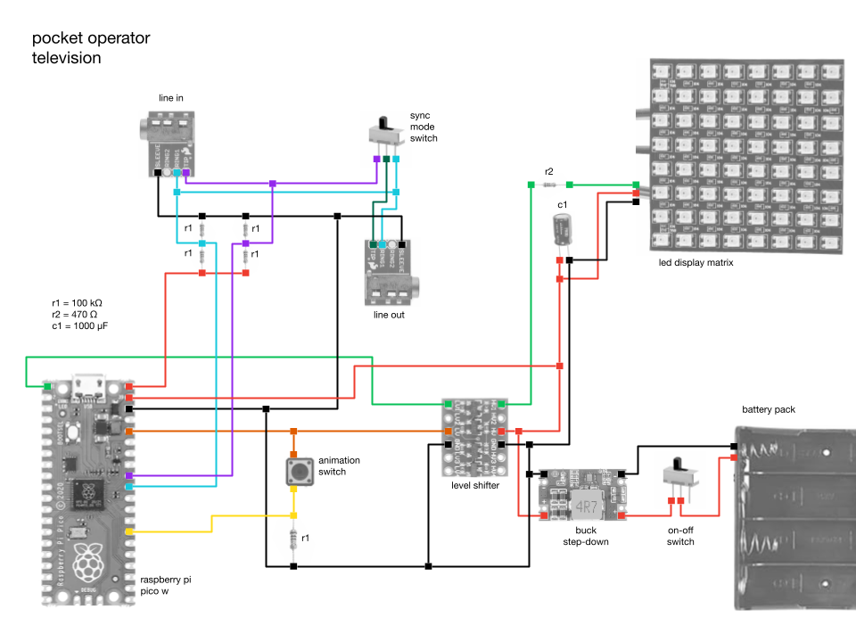

# Pocket Operator Television


The pocket operator television is a DIY device designed to display animations in sync with one or more pocket operators. It uses PO-Sync to automatically synchronise the animation frames to your music. It works in SY5 mode, if you want to chain together more devices, or in SY4 mode, if you want to connect a headset, speaker, etc.

The PO television allows you to switch between animation patterns with the press of a button. It comes preloaded with a few animations, but you can easily add your own "animation samples" to the code (more details below).

The pocket operator television is made entirely from off-the-shelf components and 3D printed parts. Its design tries to mimic the pocket operator: exposed black circuit boards, gold parts and strong colors in prominent parts. It's easy to build one for yourself!

## Electronics

#### Component List
- 1x Raspberry Pi Pico W – the brains of the PO television
- 2x 3.5m audio jack – this will act as the input and output line of the device
- 1x button – to toggle between animations
- 2x switches – one to turn the device on/off and one to toggle between synchronization modes (SY4/SY5)
- 1x LED matrix display (8x8) – to output our animations
- 1x level shifter – to convert the 3.3V signal from the Raspberry Pi into a 5V signal to send to the display
- 1x step-down buck converter – to convert an external power supply to 5V and power our circuit
- 1x AAA battery holder – you can use other power supplies since we will be using a step-down buck converter, but I would recommend AAAs since they are the same ones used in the pocket operator, so you don't need to carry around several different types with you you
- 5x 100k 1 ohm resistors, 1x 470 ohm resistor and 1x 1000uF capacitor – these will be used throughout the circuit, more details below

#### The circuit



**Notes on reading the audio input signal**

We want to listen to two signals coming from the line-in of the device: the PO-Sync signal and the audio signal itself. We will pass both of these through a voltage divider (the `r1` resistors) rather than reading directly from the source. Since the voltage division is done in half, we don't need to use 100k ohms resistors specifically, you can use any value as long as they are the same.

**Notes on connecting the animation switch button**

The `r1` resistor connected to the power button ensures that we have a ground reference for when the button is not pressed. I used a 100k ohms resistor since I was already using one of the same value in the voltage divider circuit for reading the line-in signal, as explained above. Here, you can also use different values ​​for this resistor in the animation toggle button, if you prefer.

**Notes on the PO-Sync Mode Switch**

Between the audio input and output, there is a switch that allows you to switch between SY5 mode, which passes the PO-Sync clock signal through to other devices that can be daisy-chained, and SY4 mode, which copies the audio signal to both inputs and allows you to listen to the sound through a speaker or headphones in the line-out.

**Notes on connecting the LED matrix display**

I connected the LED matrix display as recommended by the [Adafruit team in the NeoPixel guide](https://learn.adafruit.com/adafruit-neopixel-uberguide/basic-connections). You can learn more about how to use them properly there, especially if you want to modify your pocket operator television to work with different displays or LED strips.

## Hardware

The 3D printed case is very simple. It is meant to hold the display, circuit board, and animation toggle button together. The LED matrix display I purchased came with a JST cable soldered to it, so I used that to connect to the board. For consistency, I also used a JST cable to connect the animation toggle button to the circuit board. The main case and back cover can be joined together using M2 screws and nuts.

You can find the 3D models I used in the `.stl` files in the `models` folder. Feel free to modify them to better suit your needs, as you may need to change them to fit your circuit board and display if they don't have the same dimensions as mine.

## The code

#### Setup

You can download the repository as a `.zip` or clone the repository with `git clone git@github.com:EEmery/po-television.git`. The code uses MicroPython and you will need to install the firmware on your board, [but it is a simple process](https://projects.raspberrypi.org/en/projects/getting-started-with-the-pico/3).

Once you have the repository and the firmware installed, we can copy the files from the local `src/` folder to the board you are using. This repository sets in the requirements file (`requirements/dev.txt`) a series of tools to facilitate development with MicroPython, such as `thonny`, `rshell` and `pipkin`. To activate the virtual environment with these tools, simply run the following in your terminal:

1. `python3 -m venv .venv`
2. `source .venv/bin/activate`
3. `python3 -m pip install -r requirements/dev.txt`

The repository already contains the files for the `neopixel` library, which is used to communicate with the LED display, so you don't need to install it. But, if you feel the need to reinstall this library, just run the command below while your computer is connected to your board:

```
python3 -m pipkin install neopixel
```

To send the code from your local repository to the board, just use the `rshell` copy command:

```
rshell cp -r src/* pyboard/
```

If you prefer to develop with `Thonny`, which is quite popular when it comes to MicroPython development, instead of using `pipkin` to install the libraries and `rshell` to send the code to the board, just run:

```
python3 -m thonny
```

#### Diving into the code

We basically have something similar to a "sense-plan-act" structure, common in the world of robotics. The code first reads the audio input signal and processes it into parameters that are easier to consume in the following steps.

At each step change (clock pulse), we call the animation function to request a new frame to be displayed. This is the "planning" phase of our framework. We pass to the animation function some parameters that we were able to collect from the pocket operator, so that we can use them (or not) to construct the next frame. The list of parameters [can be seen in the code](https://github.com/EEmery/po-television/blob/main/src/animation_robot_eyes.py#L141-L168).

The animation function will [return 2 parameters](https://github.com/EEmery/po-television/blob/main/src/animation_robot_eyes.py#L190). The first is the new frame, which consists of a 2D 8x8 list where each value is a triplet (tuple) representing the pixel's RGB values ​​(red-green-blue). Each element in the pixel can range from 0 to 255. The second value it returns is called `memory` and should be used however the developer wishes. The idea behind this is to allow any "state" to be passed between the previous function call and the current one, so that the code can "remember" relevant information from its previous executions. This could have been achieved with an object instead of a function, but I feel like it could have made the code a bit more complex to modify, given that a "state" can be achieved with a simple function parameter, like the one we used.

Finally, with a new frame in hand, we update the display with it. This is our "action" stage of the framework and the end. We then proceed to the loop and start "sensing" the signal at the audio input once again.

During this loop, we also keep checking to see if the animation button has been pressed. When this happens, the code switches the animation function from a list of available animation functions for use.

#### Adding your own animation

Adding your animation is easy, you can start by replicating some of the existing animations to create your own.

**1. Robotic arm animation [`animation_robot_arm.py`](https://github.com/EEmery/po-television/blob/main/src/animation_robot_arm.py)**

This is the simplest of all the animation functions. Basically, we have 16 frames in the animation and we iterate one by one as the function is called in a new step. This function does not use most of the arguments passed to it. The code is commented for better understanding.

**2. Wave animation [`animation_wave.py`](https://github.com/EEmery/po-television/blob/main/src/animation_wave.py)**

This animation is very similar to the previous one, with the difference that it allows you to use any number of frames, it does not have to be exactly 16, which ends up making the code flexible to be reused frequently.

Here, we save the cursor information of the current animation in memory to remember where we left off in the next function call. This way, we can iterate through the frames one by one. The code is commented for better understanding.

**3. Robotic eye animation [`animation_robot_eyes.py`](https://github.com/EEmery/po-television/blob/main/src/animation_robot_eyes.py)**

As mentioned before, the animation `animation_wave.py` serves as a good template to be replicated in other animations, since it allows the flexibility of any number of frames. This animation, `animation_robot_eyes`, is practically a copy of `animation_wave`, with the only difference being the frames used, which form a different drawing.

**4. Music visualization animation [`animation_music_visualization.py`](https://github.com/EEmery/po-television/blob/main/src/animation_wave.py)**

This is a slightly more complex animation, compared to the others. It serves mainly to demonstrate a possible use of the parameters that are calculated from the audio input of the pocket operator. In it, we draw a representation of the intensity of the sound signal in each of the steps. The code is commented in each step for better understanding.

**Add a call to your new animation function**

Whether you are copying an existing animation and modifying it or creating a new one from scratch, you need to add a call to the new function in the main loop of the code. To do this, in the `main.py` file, simply [import the function](https://github.com/EEmery/po-television/blob/main/src/main.py#L3-L6) and add it to [the list of functions called `ANIMATIONS`](https://github.com/EEmery/po-television/blob/main/src/main.py#L8-L14).
